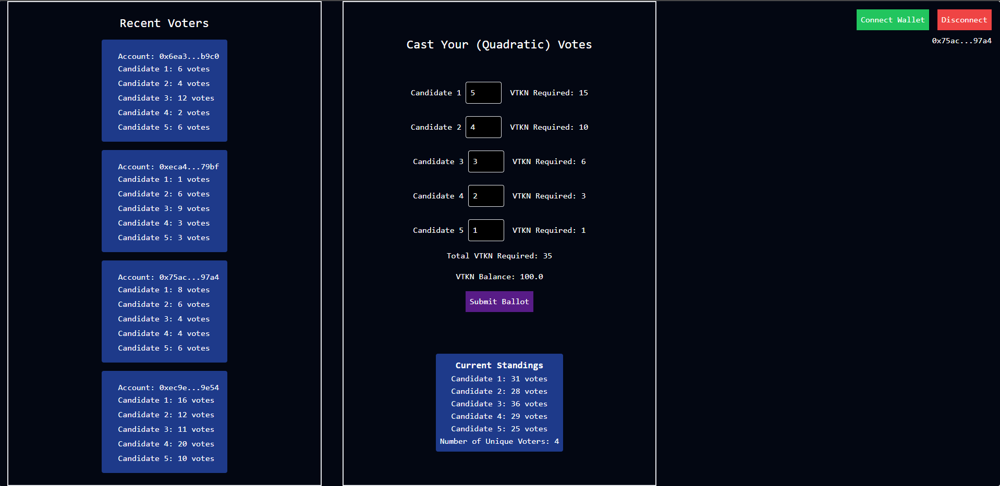
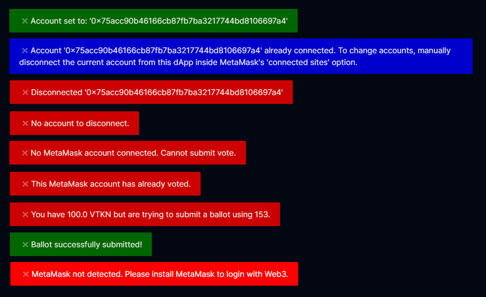

## Overview
Quadratic Voting dApp using MongoDB, Next.js 13, Node.js & Web3 concepts. Users must login with a MetaMask account to submit a ballot containing their votes to the database. A dummy token `VTKN` was deployed on Sepolia Testnet to act as vote credits in the quadratic voting system. 

## Build Process/Requirements
- Must be familiar with deploying smart contracts (I used hardhat with toolbox), Next.js 13, and MongoDB+Mongoose 7.
- Run `npm install`, `npx hardhat init`, and `npx create-next-app appname` to produce all the missing directories from .gitignore.
- Runs locally via `localhost:3000` using `npm run dev`. Must deploy `VoteToken.sol` on Sepolia so you have `VTKN` to actually test the dApp. You can distribute the token to multiple MetaMask addresses if you want to simulate voting. Also be sure to change the address to your deployed token inside `page.js`, and verify the ABI is correct. REMEMBER to be on the SEPOLIA network!

## What is a Quadratic Ranking System?
The core concept of a `Quadratic Ranking System` is that an `nth` return costs `n` units of `time/energy/cost`. In a Quadratic voting system, the `nth` vote should cost `n` vote credits. For example, the 3rd vote will cost 3 credits, but the total cost for tallying up 3 votes also includes the cost for each previous vote needed to get to the 3rd vote. 

- 1 vote costs 1 vote credit total.
- 2 votes costs 3 vote credits total. (2 credit cost for 2nd vote, 1 credit cost for 1st vote).
- 3 votes costs 6 vote credits total. (3 credit cost for 3rd vote, 2 credit cost for 2nd vote, 1 credit cost for 1st vote).

This sequence (1, 3, 6, 10, 15...) is called the `triangular number sequence`. The `nth` number in the sequence corresponds to the `total cost` within our quadratic voting system. You can calculate the `nth` triangle number in the sequence with `n*(n+1)/2`. Notice it simplifies to a quadratic expression: `(n^2+n)/2`. If `n` is the number of votes someone wants to cast for a candidate, then the total cost in vote credits will be `(n^2+n)/2`. 

Vitalik's blog on Quadratic Payments briefly approximates it to be `n^2/2` using graphs, but he forgets the additional `n` from the most recent vote.

If everyone is given 100 credits, does not mean that each will get the same number of votes. Because each vote costs a different amount, some may choose to spread out votes more, giving more total votes. Or some may choose to stack votes heavily on one candidate, which will consume more vote credits more quickly.

Most people seem to think the cost of the `nth` vote should be `n^2` which escalites way to fast in a quadratic manner for the cost of the nth vote, rather than in a quadratic manner for the total cost. However, this results in a cubic `n^3` function for the total cost. It makes more sense to have the cost of the `nth` vote be linear in proportion to the `n` credit cost, which then corresponds to a quadratic total cost.

Is a Quadratic Rank System more fair or defines better detail for voting systems?
Humans have biases in number selection.

## Core Web2 File Explanations (Mostly for Me)
- `database.js` 
    - Contains `dbConnect` function using mongoose to track and handle connection state of database. The database is named `voterdatabase`.
- `route.ts` 
    - DB Schema is two objects, the voter's `account` address, and a `voteArray` containing all the votes from a users ballot. The DB Model is `VotingData` named after the `votingData` collection.
    - `GET` function fetches all documents from the `votingData` collection.
    - `POST` function writes a users ballot, which is the `votingData`, which contains `voteArray` and `account` to the database.
- `page.js`
    - There are no components, I like the simplicity of this single file. The code in this file is described well, no need to reiterate here.
    - Four sections: `State Variables & Hooks`, `Web2 Functions`, `Web3 Functions`, and the jsx `return`.

## Next.js 12 vs 13 Changes (Mostly for Me)
- `pages` directory is now `app`. API routes are now API route handlers. The routes must be in `app`, recommended inside `app/api`.
- Name routes with the folder they are housed in: `app/api/myroutename`. The route within `myroutename` should always be called `route.ts`.
- `route.ts` names functions based directly on the HTTP method (GET, POST, PUT, DELETE, etc.).
- To make a GET request from `page.js`, we would name a function `GET` inside `route.ts`.
- The new App Router supports shared layouts, nested routing, loading states, error handling, etc.
- The components inside `app` default to React Server Components, but can also use/declare them as Client Components. 

## Notes (Mostly for Me)
- Run `npm init -y` to install basic package.json.
- Run `npx create-next-app appname` to create most of the starter folders for a Next.js project (`app` folder, `.next` folder)
- Run `npm run dev` which starts a local development server at `http://localhost:3000`. 
- Run `npx hardhat init` with baseline javascript project.
- Run `npx hardhat run scripts/deploy.js --network sepolia` to deploy `VoteToken.sol`. `VTKN`: `0xcb76a79aE432a579c80be9674ce1Ab4a5A5E6f0D`.
- Run `npm install ws bufferutil utf-8-validate --save-optional` to fix warnings in terminal for Next.js 13 with ethers.
- Run `npm install toastify-js` for frontend popup notifications.
- Run `npm install mongodb` and `npm install mongoose` to install MongoDB and Mongoose. MongoDB sets up local server on my machine that can accept connections and store data. Mongoose makes CRUD easier with Object Data Modeling (ODM) so I can interact with MongoDB using JSON instead of raw queries. MongoDB housed locally at `C:\Program Files\MongoDB\Server\7.0\`. MongoDB Compass is the GUI. Database name is `voterdatabase`, connection string `mongodb://127.0.0.1:27017/voterdatabase`.
- My API route handlers and database connection logic is housed inside `app/api`. The route name is the folder name. Inside `voterouting` contains `route.ts` and `database.js`. The route file must be named `route.ts`. Route handlers substitute the traditional Express backend server.

## References
- Vitalik on 'Quadratic' Rank Systems - https://vitalik.ca/general/2019/12/07/quadratic.html
- Next.js docs: https://nextjs.org/docs
- Mongoose docs: https://mongoosejs.com/docs/
- MetaMask docs: https://docs.metamask.io/
- Hardhat docs: https://hardhat.org/docs
- Solidity docs: https://docs.soliditylang.org/en/v0.8.21/
- Ethers 6 docs: https://docs.ethers.org/v6/